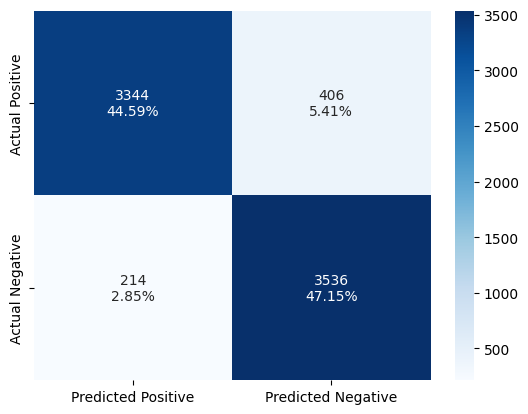

# Análise de Sentimentos com BiGRU

Este repositório contém a implementação de um modelo de Deep Learning para análise de sentimentos.

## 📋 Visão Geral

O projeto consiste em um pipeline completo (treinamento, validação e teste) para classificar avaliações de filmes como positivas ou negativas.

## 📊 Dataset

O modelo foi treinado na base de dados [**StanfordNLP/IMDB**](https://www.google.com/url?q=https%3A%2F%2Fhuggingface.co%2Fdatasets%2Fstanfordnlp%2Fimdb) do Hugging Face

## 🧪 Estratégias de Embedding

Para investigar o impacto da representação semântica no desempenho da BiGRU, foram comparadas duas abordagens distintas:

1.  **Embeddings Pré-treinados (GloVe):**
    Utilização dos vetores do *Global Vectors for Word Representation* (GloVe)

2.  **Embeddings Treináveis:**
    Inicialização de uma camada de embeddings aleatória, onde as representações vetoriais são aprendidas durante o treinamento.

## 📈 Resultados

Comparativo de desempenho entre as técnicas:

**Métricas no Dataset de Validação**
| Estratégia de Embedding | Acurácia | Perda (Loss) |
| :--- | :--- | :--- |
| Pré-treinado(GloVe) | 89.6% | 0.2496 |
| Aprendido no Treinamento | 91.8% | 0.2209 |

**Métricas no Dataset de Teste**
| Estratégia de Embedding | Acurácia | 
| :--- | :--- |
| Pré-treinado(GloVe) | 89.4% 
| Aprendido no Treinamento | 91.7%

 
<table>
  <caption><b> Matrizes de Confusão - Dataset de Teste</b></caption>
  <tr>
    <td align="center"><b>Embeddings GloVe</b></td>
    <td align="center"><b>Embeddings Aprendidos no Treinamento</b></td>
  </tr>
  <tr>
    <td></td>
    <td></td>
  </tr>
</table>
